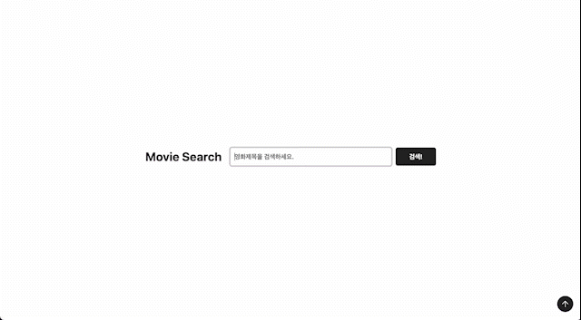
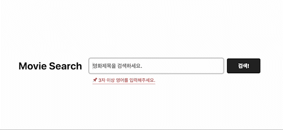
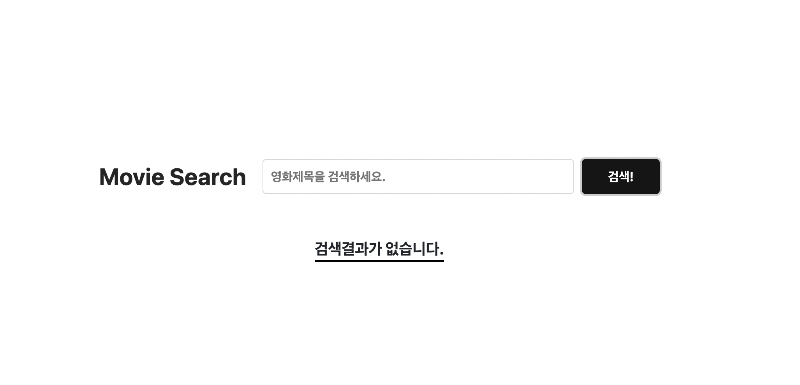
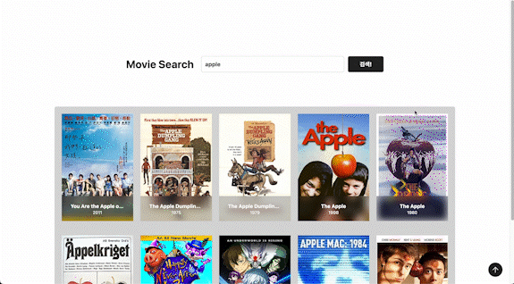

# 🎬 Movie App

[ 작업한 대모 사이트 ](https://strong-rolypoly-f45a54.netlify.app/)

- 작업 기간: 2023년 01월 06일(금) ~ 2023년 01월 08일(일)

- 내용:
  - omdb API로 영화 검색 구현
  - 검색 시 글자수 제한
  - 무한스크롤 적용 (하단 스크롤 위치를 감시하여 다음페이지 출력)
  - 상세정보 창은 특정 영역 밖 클릭시 닫힘
  - scrollTop 구현
  - 로딩 애니메이션, Flip 애니메이션
  - 이미지 리사이징
  - 대체 이미지 적용
  - 검색정보가 없거나, 글자수 제한 에러 대응

---

- 사용 언어: HTML, SCSS, JS

---

### ❗ 필수

- [x] 영화 제목으로 검색 가능하고 검색된 결과의 영화 목록이 출력돼야 합니다.
- [x] jQuery, React, Vue 등 JS 라이브러리와 프레임워크는 사용하지 않아야 합니다.
- [x] 스타일(CSS) 라이브러리나 프레임워크 사용은 자유입니다.

### ❔ 선택

- [x] 한 번의 검색으로 영화 목록이 20개 이상 검색되도록 만들어보세요.
- [x] 영화 목록을 검색하는 동안 로딩 애니메이션이 보이도록 만들어보세요.
- [x] 무한 스크롤 기능을 추가해서 추가 영화 목록을 볼 수 있도록 만들어보세요.
- [x] 영화 포스터가 없을 경우 대체 이미지를 출력하도록 만들어보세요.
- [x] 단일 영화의 상세정보(제목, 개봉연도, 평점, 장르, 감독, 배우, 줄거리, 포스터 등)를 볼 수 있도록 만들어보세요.
- [x] 영화 상세정보가 출력되기 전에 로딩 애니메이션이 보이도록 만들어보세요.
- [x] 영화 상세정보 포스터를 고해상도로 출력해보세요.(실시간 이미지 리사이징)
- [x] 차별화가 가능하도록 프로젝트를 최대한 예쁘게 만들어보세요.

---

## 사이트 소개

### 📌 메인 페이지

- 메인 페이지는 심플하게 구성
- 검색시 로딩 및 position 이동!
- Movie Search를 클릭하면 첫 화면으로 이동

#

---

 

### 🖥 검색

- 글자수를 확인하여 에러메시지 출력
- 3글자 이상 되면 에러메시지 숨김

 

- 검색결과가 없으면 문구로 출력합니다.

---

 

### 🚫 로딩 애니메이션, 플립 애니메이션

- 검색 및 무한스크롤 시 로딩 애니메이션 구현

 

- 영화 상세정보 클릭시 로딩 애니메이션 구현

 

- 마우스 hover시 플립 애니메이션 구현

---

 

### 👍🏻 프로젝트 진행 Review

    - 검색 후 다시 검색했을 때-> 검색 정보가 있을 때 -> 검색 정보가 다시없을 때 등등
    - 여러 상황에서 나는 console 창에서 확인할 수 있는 에러들을 처리하려고 하였습니다.
       - 확인했던 에러
          - 검색 정보가 없을 때
          - 검색 정보가 1개일 때 || 여러개일때
          - 글자 수가 모자랄 때
          - 무한스크롤시 마지막 totalpage 확인 에러

- 다양한 에러들을 경험하고 처리하면서 구조에 있어서 이해도가 올라간거 같습니다.
- 리팩토링을 통해서 코드를 더 재활용할 수 있도록 나누고, 불필요한 코드들은 제거해보도록 하겠습니다.
